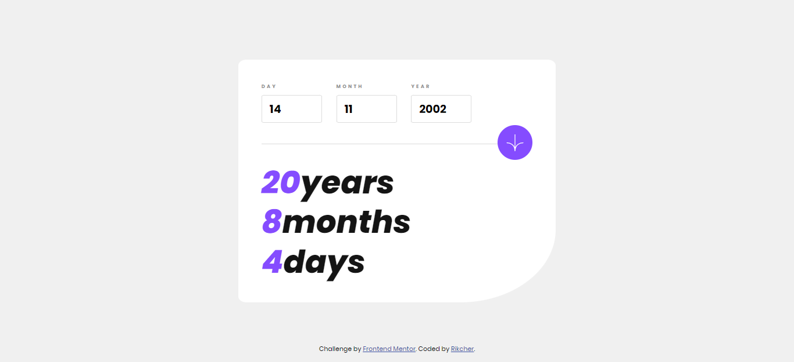
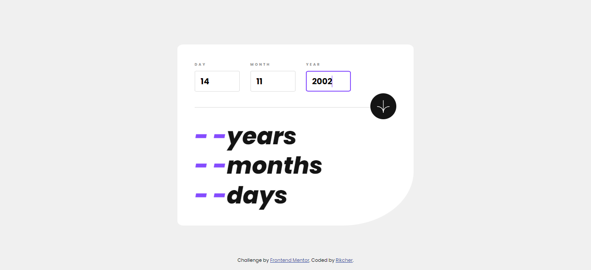
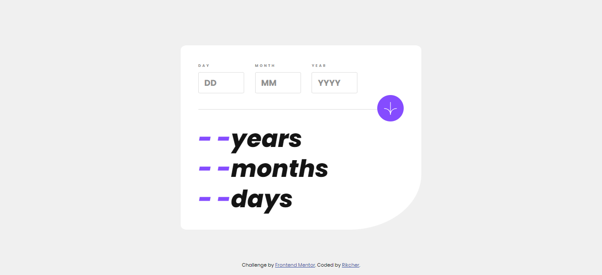
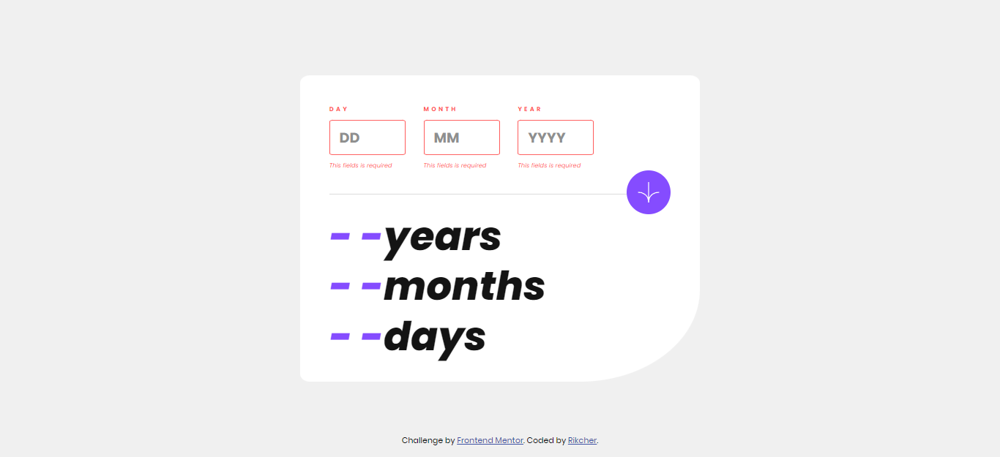
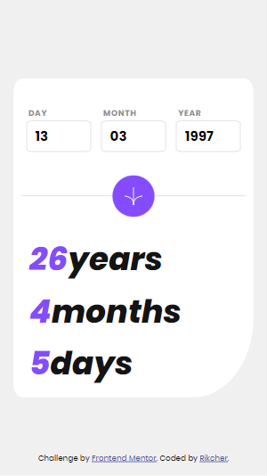
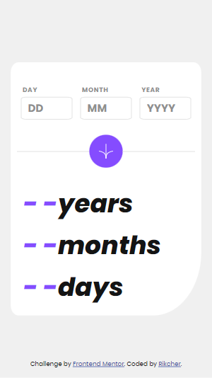
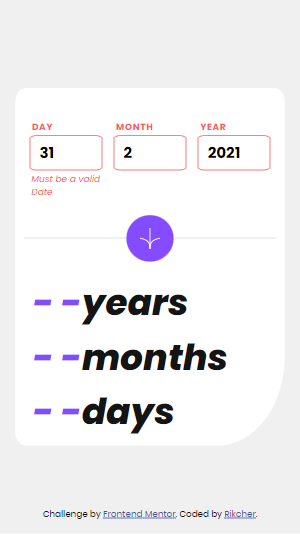

# Frontend Mentor - Age calculator app solution

This is a solution to the [Age calculator app challenge on Frontend Mentor](https://www.frontendmentor.io/challenges/age-calculator-app-dF9DFFpj-Q). Frontend Mentor challenges help you improve your coding skills by building realistic projects. 

## Table of contents

- [Overview](#overview)
  - [The challenge](#the-challenge)
  - [Screenshot](#screenshot)
  - [Links](#links)
- [My process](#my-process)
  - [Built with](#built-with)
  - [What I learned](#what-i-learned)
  - [Useful resources](#useful-resources)
- [Author](#author)

## Overview

### The challenge

Users should be able to:

- View an age in years, months, and days after submitting a valid date through the form
- Receive validation errors if:
  - Any field is empty when the form is submitted
  - The day number is not between 1-31
  - The month number is not between 1-12
  - The year is in the future
  - The date is invalid e.g. 31/04/1991 (there are 30 days in April)
- View the optimal layout for the interface depending on their device's screen size
- See hover and focus states for all interactive elements on the page
- **Bonus**: See the age numbers animate to their final number when the form is submitted

### Screenshots



desktop:
  
  
  
  
  
  

mobile:
  
  
  
  
  

### Links

- Solution URL: [Add solution URL here](https://your-solution-url.com)
- Live Site URL: [Add live site URL here](https://your-live-site-url.com)

## My process

Based on the given design, I originally made a <div></div> element instead of a form. Later I ran into the problem that the user has to click the mouse button to submit their date and can't just press the enter key to do so, so i switched regular div element to <form></form>. For the horizontal line, I decided to use the <hr> element, which I will style later.
When I started styling, the first thing I did was a basic css reset and create variables for fonts and colors. I relied solely on flexbox for positioning elements. The only problem I faced is silization of ::before element. In the end i found solution to this problem by doing this:

.answers::before {
  content: var(--answer);
  color: var(--purple);
}

By placing content in variable i could change it with js later on. Also i applied same solution to animation effect of ::before element.
The only thing i found difficult in making my javascript is properly calculating difference between todays date and users date, but after few debugs i managed to do it right.


### Built with

- Semantic HTML5 markup
- CSS custom properties
- Flexbox
- Mobile-first workflow

### What I learned

U can change ::before element with JS by placing its content inside variable like that:

```html
:root {
  --beforeDiv: ""
}
<div id="content">element</div>
```
```css
#content::before {
    content: var(--beforeDiv);
}
```
```JS
const element = document.querySelector("#content");
element.style.setProperty("--beforeDiv", "something new")
```

### Useful resources

- [resource 1](https://stackoverflow.com/questions/10495243/how-change-content-value-of-pseudo-before-element-by-javascript) - This helped me with changing of ::before element and i'll use same method if needed later on.
- [resource 2](https://www.cuemath.com/calculators/age-calculator/) - This source helped me with calculating age.

## Author

- Frontend Mentor - [@yourusername](https://www.frontendmentor.io/profile/yourusername)


